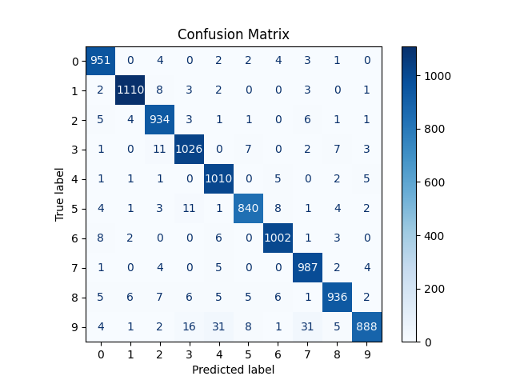

# MNIST Digit Classification Using Spiking Neural Networks (SNNs)

This project implements a biologically-inspired **Spiking Neural Network (SNN)** to classify handwritten digits from the MNIST dataset. It uses **Leaky Integrate-and-Fire (LIF)** neurons, **Poisson spike encoding**, and **surrogate gradient descent** — all built from scratch using PyTorch.

---

## Project Structure
```
├── train.ipynb # Training pipeline
├── MNIST/ # MNIST Dataset
├── confusion_matrix.png # Final evaluation
├── training_curves.png # Train Accuracy & Loss
├── requirements.txt # Requirements for execution
└── README.md
```


---

## Network Architecture
```
Input (784) → Hidden (256) → Output (10)
```

Each layer uses a custom LIF neuron model that integrates incoming spikes and fires when the membrane potential exceeds a threshold. Spikes decay over time based on a fixed leak constant.

---

## Spike Encoding

Images are encoded over 100 time steps using **Poisson spike encoding**:

---

## Results

- **Test Accuracy:** 96.84% (after 10 epochs)
- **Training Time:** ~54.5 minutes
- **Loss and accuracy curves** shows good convergence




---


## 📚 References

- [Neuro4ML](https://neuro4ml.github.io/)
- [Cosyne 2022 SNN Tutorial – Dan Goodman](https://neural-reckoning.github.io/cosyne-tutorial-2022/)

---

## To Run

You need the following libraries
```
numpy
matplotlib
torch
tqdm
scikit-learn
```
Then simply run train.ipynb jupyter notebook.